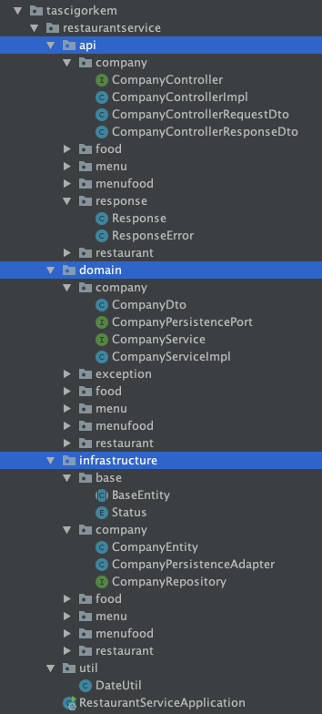
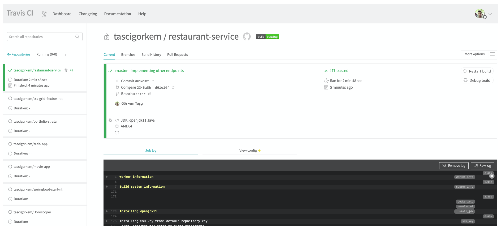
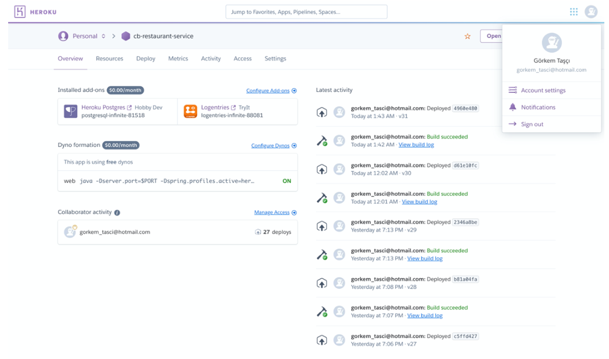
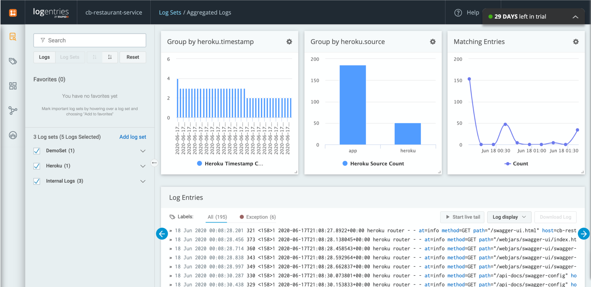
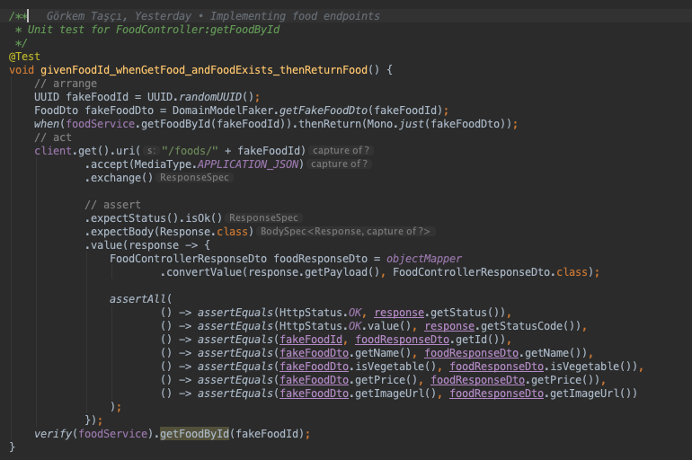
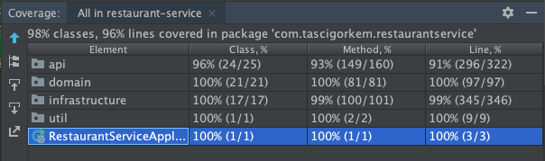
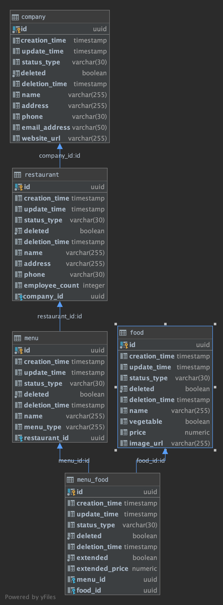
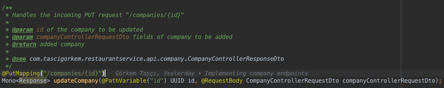
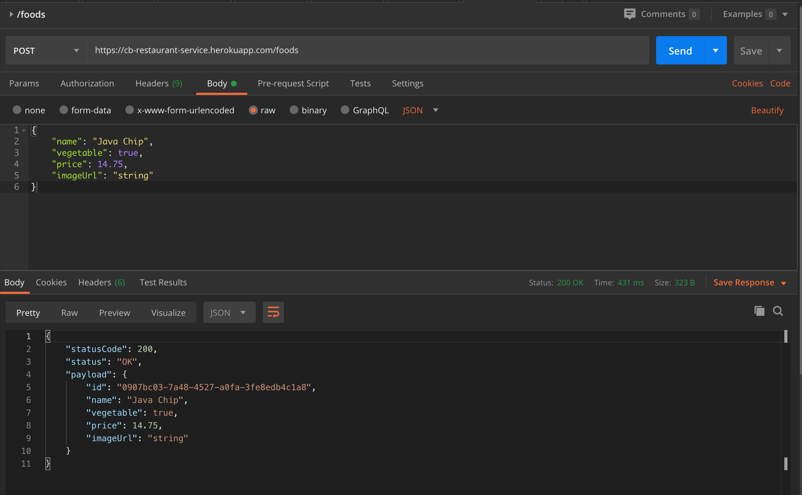
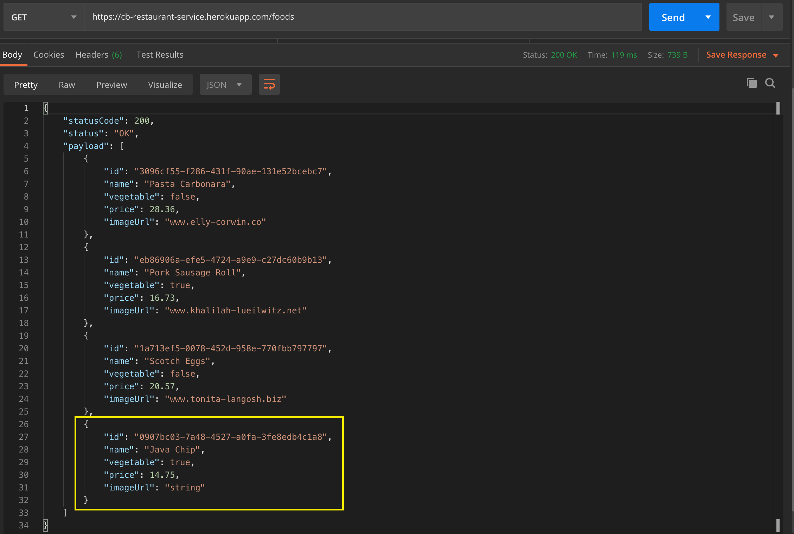

## Restaurant Service for Food Order System

    
    
    
    
    

RESTful Restaurant Service developed with Spring WebFlux and R2DBC (Postgesql) in Spring Boot.

### Hexagonal architecture

Used hexagonal architecture with TDD for this project.

Example Flow:

`Client <-> ` 

`CompanyController (I) <-> CompanyControllerImpl <->` 

`CompanyService (I) <-> CompanyServiceImpl <-> `

`CompanyPersistencePort (I) <-> CompanyPersistenceAdapter <-> `

`CompanyRepository (I) <-> ReactiveCrudRepository (I) <-> DB <-> `

`DB`

## CI & Deployment

`Github` repo connected `Travis CI` and triggered after every push to the `master` branch, then build application and running tests and started deploy to `Heroku`.

Connected `Logentries` distributed tracing tool to Heroku Application for monitoring.

#### Travis CI

Looking `.travis.yml` in beginning to build and takes CI configurations

`mvn clean install -DskipITs`

`./docs/travis-ci.pdf`

#### Heroku

Looking `Procfile` (below) in beginning to deploy and takes environment variables.

`web: java -Dserver.port=$PORT -Dspring.profiles.active=heroku $JAVA_OPTS -jar target/restaurant-service-0.0.1-SNAPSHOT.jar`

`./docs/heroku-dashboard.pdf`

#### Logentries

`./docs/logentries-1.pdf`

`./docs/logentries-2.pdf`

`./docs/logentries-3.pdf`

## Tests

Run `mvn integration-test` for Integration Tests (**/*IT.class)

Run `mvn test` for Unit Tests (**/*Test.class)

#### Test Pattern

Used patterns:

* TDD (Test Driven Development)

* 3A (Arrange, Act, Assert) 

* Given, When, Then and BDD (Behavior-Driven Development)

for unit tests and integration tests.

#### Test Coverage

98% classes, 96% lines covered in project.

## Database

#### Postgres - R2DBC

Used Postgres for DB and R2DBC for Postgres for CRUD operations.

## Docs

Docs located `./docs` folder in project main folder.

#### Javadoc

Used javadoc standarts for method comments.

Run `mvn javadoc:javadoc` for create javadocs.

#### Swagger & Api-Docs

Used Swagger and Api-Docs for RestAPI endpoints.

https://cb-restaurant-service.herokuapp.com/swagger-ui.html

https://cb-restaurant-service.herokuapp.com/api-docs

#### Docker Hub

Application dockerized via `./Dockerfile` and pushed `DockerHub`. 

https://hub.docker.com/r/tascigorkem/restaurant-service

## Problems

TR:

Zamanım da kısıtlı olduğu için çözemediğim kısımlar:

**1 -** Projeyi dockerize ettim, fakat oluşan image'i deploy etmeyi başaramadım. Fakat DockerHub'a push'ladım oradan pull edilebilir.
Docker image'ı deploy edemeyince docker-compose kullanmak istedim. postgres ve spring boot 
uygulamayı tek bir compose dosyasına yazdım. O da lokalde çalışmasına rağmen deploy etmeyi başaramadım. Daha fazla 
burada zaman kaybetmek istemedim.

**2 -** Postgres db'si Heruko üzerinde ayakta olduğu için Travis'te proje ayağa kalkarken integration test'ler
db'ye ssl hatasından hatasından dolayı erişemiyor ve hata oluyor. Bu Travis'te proje build olurken sadece unit 
test'leri çalıştırıyor. `mvn clean install -DskipITs` ile IT'ler skip ediliyor.

**3 -** Spring Reactive Webflux kullandığımdan dolayı DB tarafında JPA, Hibernate kullanamadım. 
Bunun yerine R2DBC for Postgres kullandım. Bu yüzden `@OneToMany` `@CreationTimestamp` gibi bazı annotation'lar kullanılamadı.