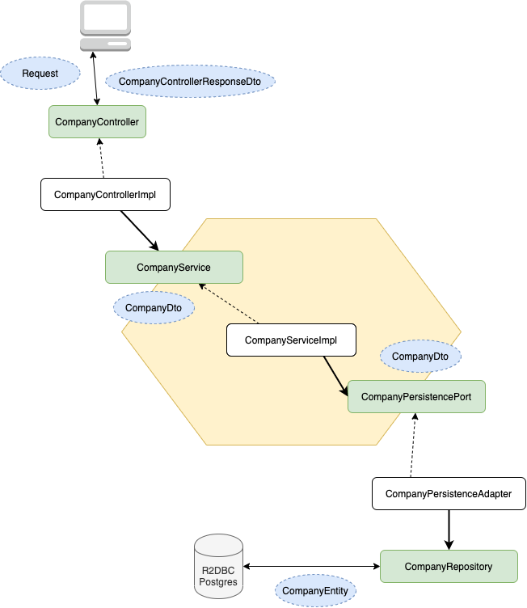

## Restaurant Service for Food Order System

<p align="center">
    <a alt="Java">
        
    </a>
    <a alt="Spring Boot">
        
    </a>
    <a alt="Dependencies">
        
    </a>
    <a alt="Contributions">
        
    </a>
    <a alt="Licence">
        
    </a>
</p>

RESTful Restaurant Service developed with reactive approach (Spring WebFlux and R2DBC - Postgesql) in Spring Boot.

### Hexagonal architecture

Used hexagonal architecture with TDD for this project.

Example Flow:




## CI & Deployment

`Github` repo connected `Travis CI` and triggered after every push to the `master` branch, then build application and running tests and started deploy to `Heroku`.

Connected `Logentries` distributed tracing tool to Heroku Application for monitoring.

#### Travis CI

Looking `.travis.yml` in beginning to build and takes CI configurations.

`...`

`mvn clean install -DskipITs`

``...``

Screenshot: `./docs/travis-ci.pdf`


#### Heroku

Looking `Procfile` (below) in beginning to deploy and takes environment variables.

`web: java -Dserver.port=$PORT -Dspring.profiles.active=heroku $JAVA_OPTS -jar target/restaurant-service-0.0.1-SNAPSHOT.jar`

Screenshot: `./docs/heroku-dashboard.pdf`


#### Logentries

Screenshot: `./docs/logentries-1.pdf`

Screenshot: `./docs/logentries-2.pdf`

Screenshot: `./docs/logentries-3.pdf`


## Docker

Application dockerized via `./Dockerfile` and pushed `DockerHub`. 

https://hub.docker.com/r/tascigorkem/restaurant-service

`docker pull tascigorkem/restaurant-service`

`docker run -p 8080:8080 restaurant-service`

## Tests

Run `mvn integration-test` for Integration Tests (**/*IT.class)

Run `mvn test` for Unit Tests (**/*Test.class)

#### Test Pattern

Used patterns:

* TDD (Test Driven Development)

* 3A (Arrange, Act, Assert) 

* Given, When, Then and BDD (Behavior-Driven Development)

for unit tests and integration tests.


#### Test Coverage

98% classes, 96% lines covered in project.


## Database

#### Postgres - R2DBC

Used Postgres for DB and R2DBC for Postgres for CRUD operations.

Database Schema Generation - Sql: `./src/test/resources/schema.sql`

Database Example Inserts - Sql: `./src/test/resources/inserts.sql`

Database Credentials: `./src/main/resources/application-heroku.properties`


## Docs

Docs located `./docs` folder in project main folder.

#### Javadoc

Used javadoc standarts for method comments.

Run `mvn javadoc:javadoc` for create javadocs.


#### Swagger & Api-Docs

Used Swagger and Api-Docs for RestAPI endpoints.

https://cb-restaurant-service.herokuapp.com/swagger-ui.html

https://cb-restaurant-service.herokuapp.com/api-docs


## Notes

**Scenario:** "Scotch Eggs" food added under the menu with POST request and its normal price that identified by company is $20.57, 
but restaurant extended its price to $26.56 while adds to menu.


https://cb-restaurant-service.herokuapp.com/foods/1a713ef5-0078-452d-958e-770fbb797797

Response:

`GET: /foods/{id}`
 
```json
{
    "statusCode": 200,
    "status": "OK",
    "payload": {
        "id": "1a713ef5-0078-452d-958e-770fbb797797",
        "name": "Scotch Eggs",
        "vegetable": false,
        "price": 20.57,
        "imageUrl": "www.tonita-langosh.biz"
    }
}
```

https://cb-restaurant-service.herokuapp.com/menus/8b03175c-af6c-4cab-a958-70d53369fe5c/
 
`GET: /menus/{id}`

 Response:

 ```json
 {
     "statusCode": 200,
     "status": "OK",
     "payload": {
         "id": "8b03175c-af6c-4cab-a958-70d53369fe5c",
         "name": "magni",
         "menuType": "et",
         "restaurantId": "9d7cfe42-e7dd-44b5-b01b-2fbaa6dd619e"
     }
 }
 ```
 

https://cb-restaurant-service.herokuapp.com/menus/8b03175c-af6c-4cab-a958-70d53369fe5c/foods/1a713ef5-0078-452d-958e-770fbb797797

`POST: /menus/{menuId}/foods/{foodId}`

Request:

```json
{
  "extended": true,
  "extendedPrice": 26.56
}
 ```

`GET: /menus/{menuId}/foods/{foodId}`

Response:

```json
{
     "statusCode": 200,
     "status": "OK",
     "payload": {
         "id": "c91160e7-0820-425f-8def-17442672c48a",
         "menuId": "8b03175c-af6c-4cab-a958-70d53369fe5c",
         "foodId": "1a713ef5-0078-452d-958e-770fbb797797",
         "foodName": "Scotch Eggs",
         "originalPrice": 20.57,
         "extended": true,
         "extendedPrice": 26.56
     }
 }
 ```
 
 


## References

https://docs.spring.io/spring/docs/current/spring-framework-reference/web-reactive.html

https://docs.spring.io/spring-data/r2dbc/docs/1.1.0.RELEASE/reference/html/#reference

Görkem Taşçı,

2020
